## Getting Started Guide

Follow this guide to:

- Set up a command-line Zephyr development environment on Ubuntu, macOS, or Windows (instructions for other Linux distributions are discussed in [Install Linux Host Dependencies](https://docs.zephyrproject.org/latest/develop/getting_started/installation_linux.html#installation-linux))
- Get the source code
- Build, flash, and run a sample application

[TOC]

### Select and Update OS(Ubuntu)

This guide covers Ubuntu version 20.04 LTS and later

```shell
sudo apt update
sudo apt upgrade
```


#### Install dependencies

Next, you’ll install some host dependencies using your package manager.

The current minimum required version for the main dependencies are

| Tool                                               | Min. Version |
| -------------------------------------------------- | ------------ |
| [CMake](https://cmake.org/)                        | 3.20.5       |
| [Python](https://www.python.org/)                  | 3.8          |
| [Devicetree compiler](https://www.devicetree.org/) | 1.4.6        |

1. If using an Ubuntu version older than 22.04, it is necessary to add extra repositories to meet the minimum required versions for the main dependencies listed above. In that case, download, inspect and execute the Kitware archive script to add the Kitware APT repository to your sources list. A detailed explanation of `kitware-archive.sh` can be found here [kitware third-party apt repository](https://apt.kitware.com/):

```shell
wget https://apt.kitware.com/kitware-archive.sh
sudo bash kitware-archive.sh
```


2. Use `apt` to install the required dependencies:

```shell
sudo apt install --no-install-recommends git cmake ninja-build gperf \
  ccache dfu-util device-tree-compiler wget \
  python3-dev python3-pip python3-setuptools python3-tk python3-wheel xz-utils file \
  make gcc gcc-multilib g++-multilib libsdl2-dev libmagic1
```


3. Verify the versions of the main dependencies installed on your system by entering:

```shell
cmake --version
python3 --version
dtc --version
```


Check those against the versions in the table in the beginning of this section. Refer to the [Install Linux Host Dependencies](https://docs.zephyrproject.org/latest/develop/getting_started/installation_linux.html#installation-linux) page for additional information on updating the dependencies manually.

#### Get Zephyr and install Python dependencies

Next, clone Zephyr and its [modules](https://docs.zephyrproject.org/latest/develop/modules.html#modules) into a new [west](https://docs.zephyrproject.org/latest/develop/west/index.html#west) workspace named `zephyrproject`. You’ll also install Zephyr’s additional Python dependencies.

> **Note**:
>
> It is easy to run into Python package incompatibilities when installing dependencies at a system or user level. This situation can happen, for example, if working on multiple Zephyr versions or other projects using Python on the same machine.
>
> For this reason it is suggested to use [Python virtual environments](https://docs.python.org/3/library/venv.html).

1. Install west, and make sure `~/.local/bin` is on your [`PATH`](https://docs.zephyrproject.org/latest/develop/env_vars.html#envvar-PATH) [environment variable](https://docs.zephyrproject.org/latest/develop/env_vars.html#env-vars):

```shell
pip3 install --user -U west
echo 'export PATH=~/.local/bin:"$PATH"' >> ~/.bashrc
source ~/.bashrc
```


2. Get the Zephyr source code:

```shell
west init -m https://github.com/IteOpenSolution/zephyr.git --mr ite-zephyr-v3.5.0 zephyrproject
cd ~/zephyrproject
west update
```

> **Note:**
>
> This step differs from the official Zephyr Getting Started Guide. Ensure that the download URL is from IteSolution.


3. Export a [Zephyr CMake package](https://docs.zephyrproject.org/latest/build/zephyr_cmake_package.html#cmake-pkg). This allows CMake to automatically load boilerplate code required for building Zephyr applications.

```shell
west zephyr-export
```


4. Zephyr’s `scripts/requirements.txt` file declares additional Python dependencies. Install them with `pip3`.

```shell
pip3 install --user -r ~/zephyrproject/zephyr/scripts/requirements.txt
```


#### Install the Zephyr SDK

The [Zephyr Software Development Kit (SDK)](https://docs.zephyrproject.org/latest/develop/toolchains/zephyr_sdk.html#toolchain-zephyr-sdk) contains toolchains for each of Zephyr’s supported architectures, which include a compiler, assembler, linker and other programs required to build Zephyr applications.

It also contains additional host tools, such as custom QEMU and OpenOCD builds that are used to emulate, flash and debug Zephyr applications.

> **Note**:
>
> You can change `0.16.3` to another version in the instructions below if needed; the [Zephyr SDK Releases](https://github.com/zephyrproject-rtos/sdk-ng/tags) page contains all available SDK releases.

> **Note**:
>
> If you want to uninstall the SDK, you may simply remove the directory where you installed it.

1. Download and verify the [Zephyr SDK bundle](https://github.com/zephyrproject-rtos/sdk-ng/releases/tag/v0.16.3):

```
cd ~
wget https://github.com/zephyrproject-rtos/sdk-ng/releases/download/v0.16.3/zephyr-sdk-0.16.3_linux-x86_64.tar.xz
wget -O - https://github.com/zephyrproject-rtos/sdk-ng/releases/download/v0.16.3/sha256.sum | shasum --check --ignore-missing
```


If your host architecture is 64-bit ARM (for example, Raspberry Pi), replace `x86_64` with `aarch64` in order to download the 64-bit ARM Linux SDK.

2. Extract the Zephyr SDK bundle archive:

```
tar xvf zephyr-sdk-0.16.3_linux-x86_64.tar.xz
```


> **Note**:
>
> It is recommended to extract the Zephyr SDK bundle at one of the following locations:
>
> - `$HOME``
>
> - ``$HOME/.local`
>
> - `$HOME/.local/opt`
>
> - `$HOME/bin`
>
> - `/opt`
>
> - `/usr/local`
>
>   The Zephyr SDK bundle archive contains the `zephyr-sdk-0.16.3` directory and, when extracted under `$HOME`, the resulting installation path will be `$HOME/zephyr-sdk-0.16.3`.

3. Run the Zephyr SDK bundle setup script:

```
cd zephyr-sdk-0.16.3
./setup.sh
```


>  **Note**:
>
> You only need to run the setup script once after extracting the Zephyr SDK bundle.
>
> You must rerun the setup script if you relocate the Zephyr SDK bundle directory after the initial setup.

4. Install [udev](https://en.wikipedia.org/wiki/Udev) rules, which allow you to flash most Zephyr boards as a regular user:

```
sudo cp ~/zephyr-sdk-0.16.3/sysroots/x86_64-pokysdk-linux/usr/share/openocd/contrib/60-openocd.rules /etc/udev/rules.d
sudo udevadm control --reload
```

#### ITE Linux Flash Tool

1. Go to the [ITE official website](https://www.ite.com.tw/zh-tw) to download the ITE Linux Tool. The steps are as follows:


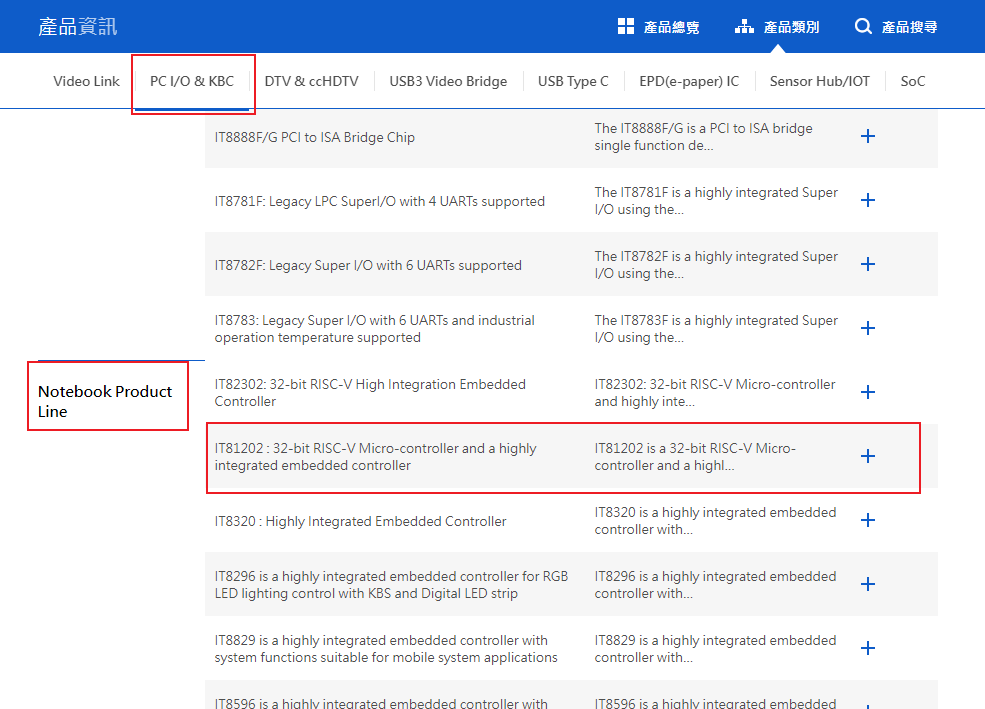

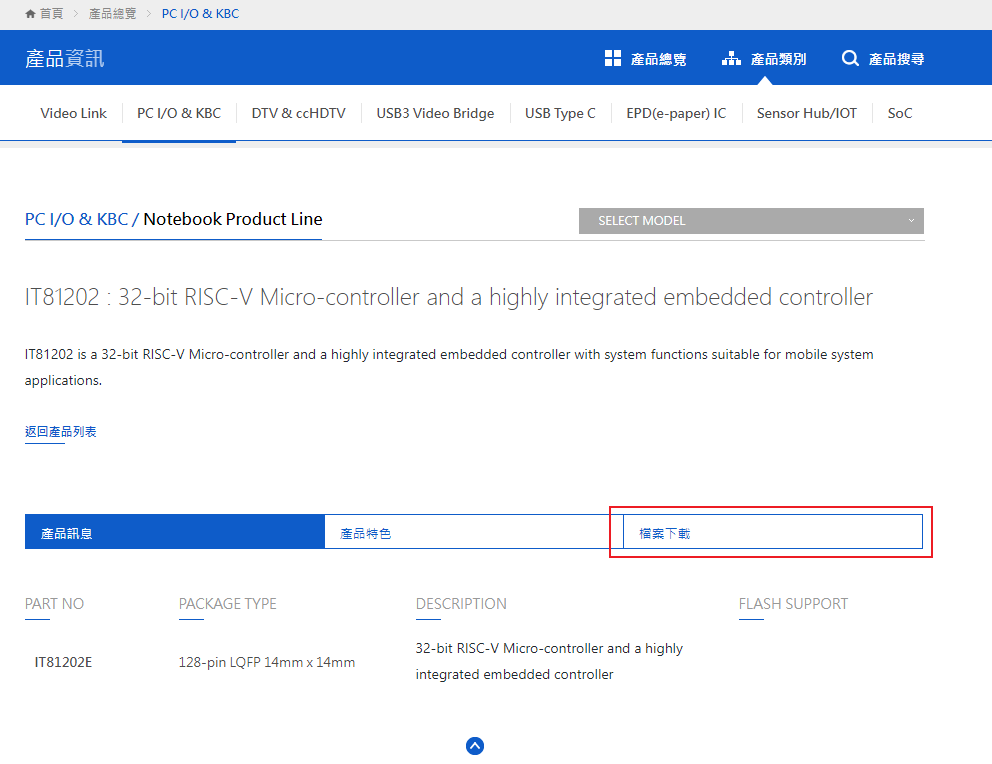

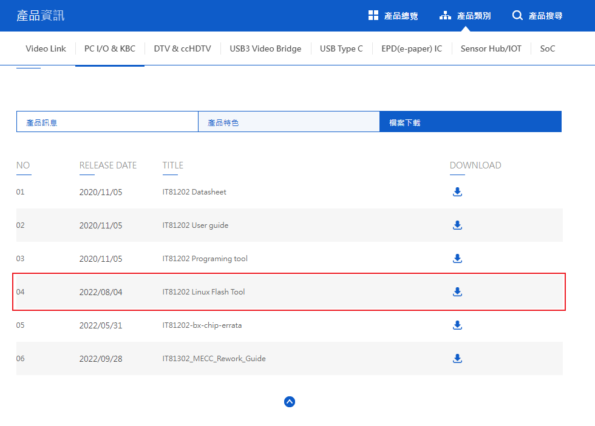

2. After downloading, the file should be in the Downloads folder. Go to the Downloads folder, right-click on the file, and choose `Open With Archive Manager`

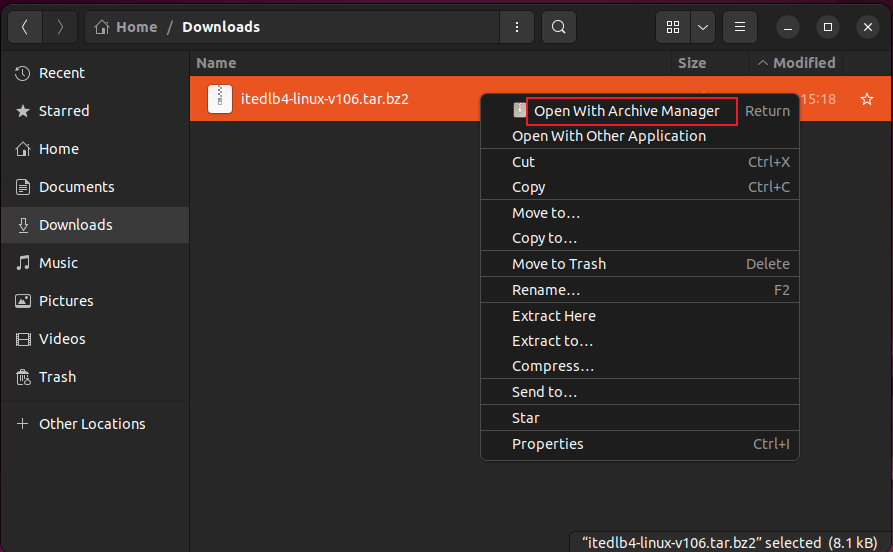

3. Click on `Extract` to unzip the file.

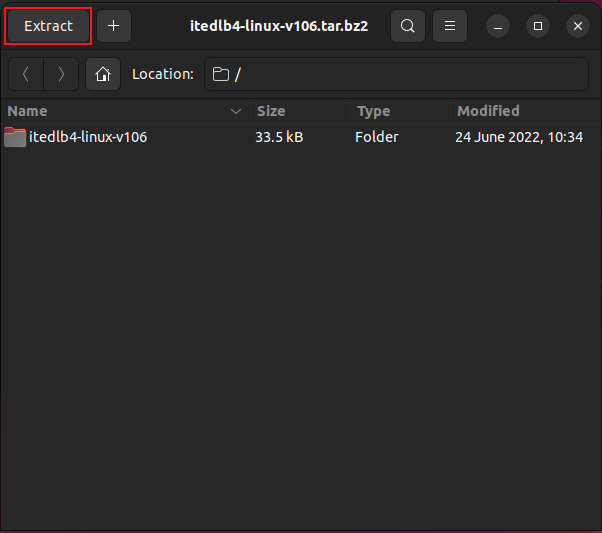

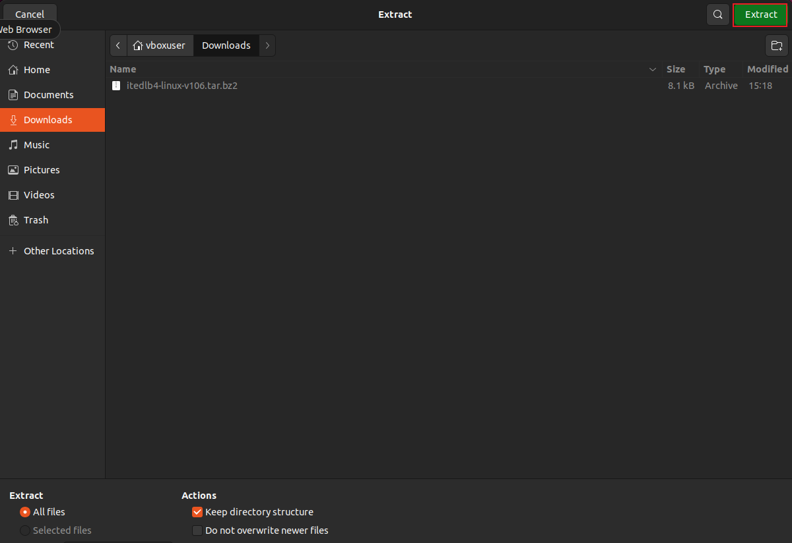

4. Move the extracted folder and the original compressed file (itedlb4-linux-v106.tar.bz2) to the `Home` directory.

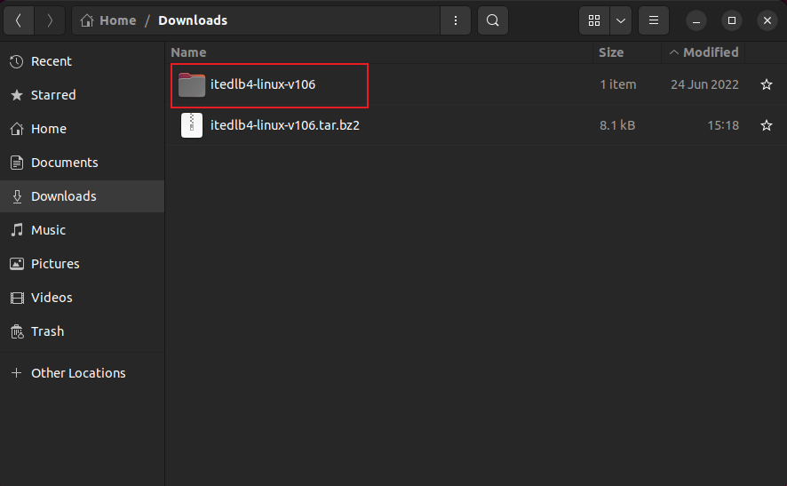

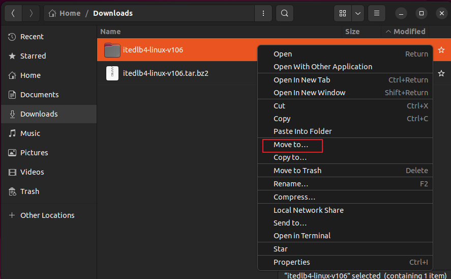

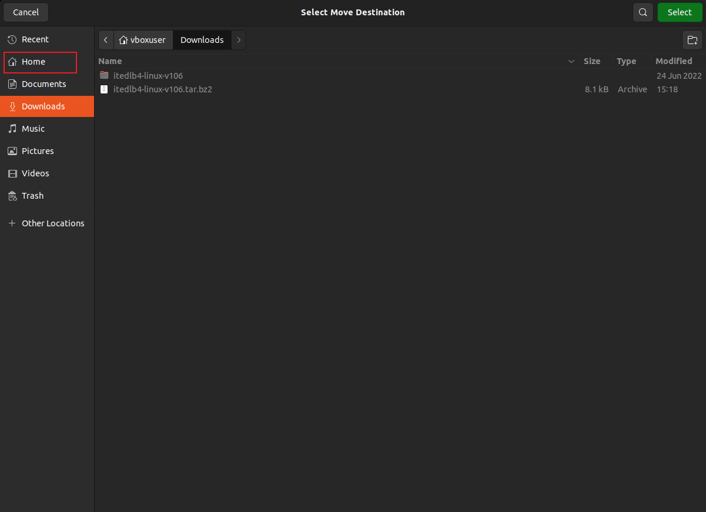

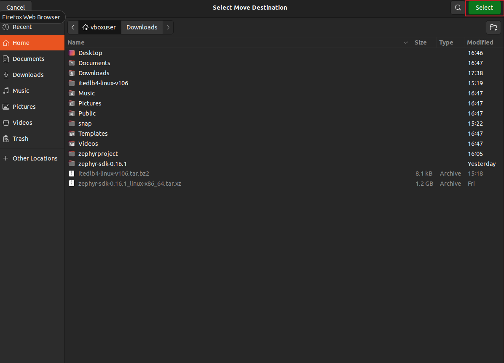

5. Right-click on the desktop, select `Open in Terminal`.
6. Follow the instructions in the `ITE Linux Flash Tool` README to install libusb. Enter the following command:

```shell
sudo apt-get install libusb-1.0-0-dev
```

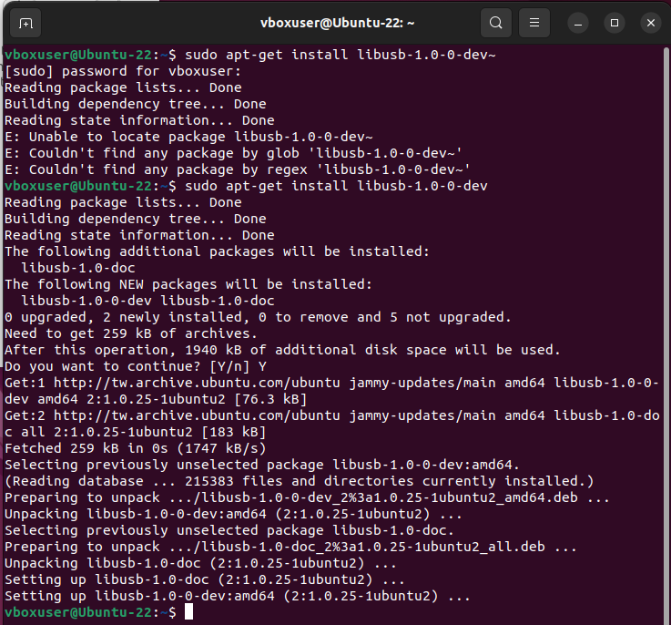

> Note
>
> When using the `sudo` keyword for the first time in a terminal, you will need to enter your password.

7. After installation, switch to `itedlb4-linux-v106/` and compile the downloaded tool. Enter the following commands:

   ```shell
   cd ~/itedlb4-linux-v106/
   make
   ```

8. Connect the Download Board to the computer.

9. Configure the Download Board to connect with Ubuntu in VirtualBox. `Open Virtual Machine -> Devices -> USB -> ITE Tech. Download Board 4`, check this item.

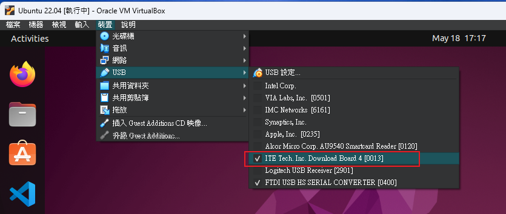

10. Now, right-click on the Ubuntu desktop, select `Open in Terminal`, and enter the following command to display connected USB devices.

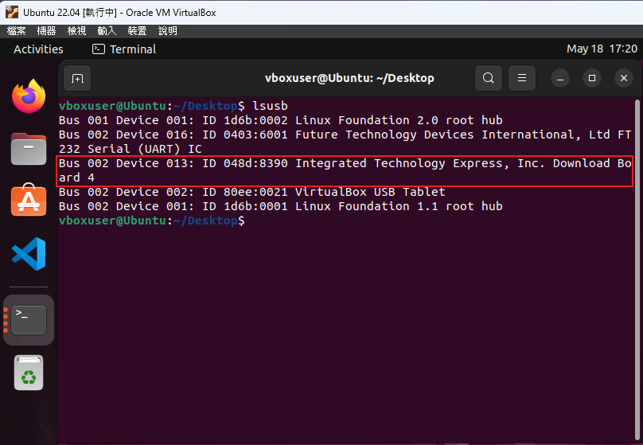


#### Build the Hello World Sample

1. To build the [Hello World](https://docs.zephyrproject.org/latest/samples/hello_world/README.html#hello-world) using [west build](https://docs.zephyrproject.org/latest/develop/west/build-flash-debug.html#west-building), with the appropriate board name `<your-board-name>` for your board, follow these steps:

```shell
cd ~/zephyrproject/
mkdir app
cd app
cp -r ~/zephyrproject/zephyr/samples/hello_world/ ~/zephyrproject/app/
cd hello_world
west build -p always -b it82xx2_evb ../hello_world
```

The process is considered successful when the displayed message is as follows:

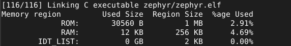


2. Transfer the compiled binary file to the EVB (Evaluation Board).

```shell
sudo ../../../itedlb4-linux-v106/ite -f build/zephyr/zephyr.bin
```

The process is considered successful when the displayed message is as follows:

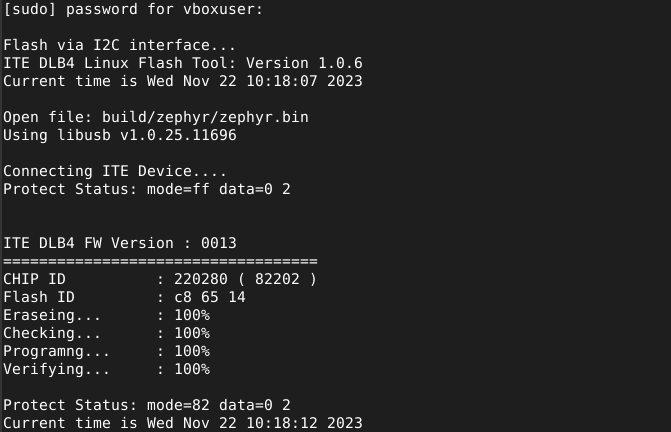


3. Connect CLK, DAT, and GND from the Download Board to the corresponding pins on the IT82202 EVB.

| Downlaod Board | IT82202 EVB      |
| -------------- | ---------------- |
| CLK            | GPIOC1(J38 Pin3) |
| DAT            | GPIOC2(J38 Pin5) |
| GND            | J102             |


4. Connect USB to RS232 to UART0, or alternatively, connect a USB to TTL board, such as FTDI 232H, with TX connected to Pin 5 on J97.


5. In Windows, open serial communication software such as PuTTY, select the corresponding COM port, and open it. Power cycle the EVB, and if you see the following message, it indicates that the environment setup is correct.

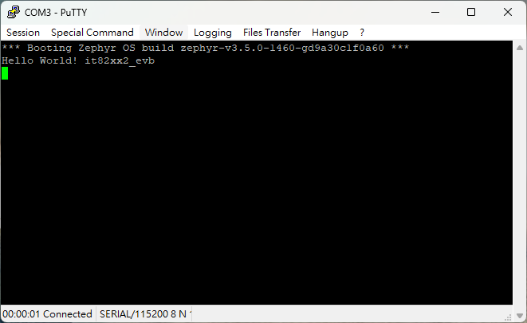

### Clone IT82202 Zephyr Application Sample

1. clone IT82202 zephyr application sample code from git

```shell
cd ~/zephyrproject/app
git clone https://github.com/IteOpenSolution/it82202-zephyr-application.git
```

2. build sample 

```shell
cd ~/zephyrproject/app/it82202-zephyr-application
./build.sh
```

3. download the it82202 zephyr binary file to EVB

```shell
./itedlb4.sh
```
Note

Ensure that the paths for Zephyr and the ITE Linux Flash Tool match the locations specified above.